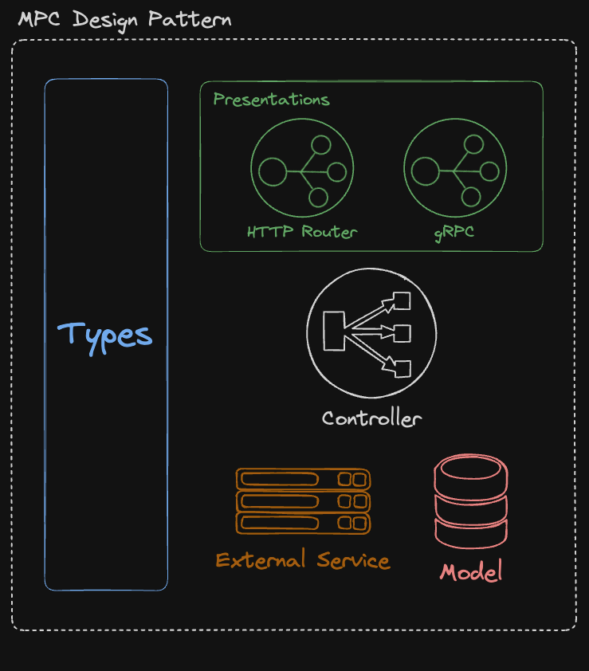

# MPC Design Pattern Implementation In Go

An E-Commerce microservice supporting both HTTP and gRPC communication protocols built in Go to demo the concept of **MPC Design Pattern** which is explained in this [article](https://medium.com/@m.a.faried/mvc-or-mpc-e907f39f9e35)

<p align='center'>
    
</p>

- **Presentations** _(src/api/presentations)_ Containing the implementation of both HTTP & gRPC protocols.
- **Controllers** _(src/api/controllers)_ for coupling the routes to their data sources which are the same in this case.
- **Models** _(src/api/models)_ The api is built using the a data access layer and DTO's located in the models folder for the accessing the database.

### To Run The App

You need 'go' installed on your machine and run

```
cd src
go mod tidy
go run .
```

### To Update & Regenerate gRPC Go Driver From The Proto File

```
cd src/api/presentations/rpc
make generate_grpc_code
```
